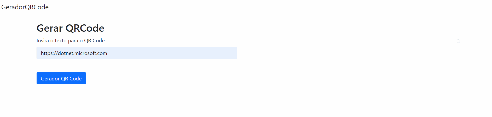

# GeradorQRCode

<p align="center">
    <a href="#aplicação-para-gerenciamento-de-um-cinema">Aplicação</a>&nbsp;&nbsp;|&nbsp;&nbsp;
    <a href="#conteúdo-do-repositório">Conteúdo</a>&nbsp;&nbsp;|&nbsp;&nbsp;
    <a href="#-tecnologias-e-frameworks">Tecnologias e Frameworks</a>&nbsp;&nbsp;|&nbsp;&nbsp;
    <a href="#pré-requisitos">Pré-requisitos</a>&nbsp;&nbsp;|&nbsp;&nbsp;
    <a href="#executando-a-aplicação">Executando a aplicação</a>&nbsp;&nbsp;|&nbsp;&nbsp;
    <a href="#-executando-os-testes-unitários-server">Testes unitários</a>&nbsp;&nbsp;|&nbsp;&nbsp;
    <a href="#features">Features</a>&nbsp;&nbsp;|&nbsp;&nbsp;
    <a href="#-autor">Autor</a>
</p>



### Aplicação gerador de código QR
A aplicação gera código QR com base no valor inserido pelo usuário.

## Conteúdo do repositório
- GeradorQRCode: Contendo a solução completa
- GeradorQRCode.Testes: Contendo a solução de testes

## 🛠 Tecnologias e Frameworks
- [.NET 6](https://visualstudio.microsoft.com/pt-br/vs/community/)
- [XUnit.Net](https://xunit.net/)

## Pré-requisitos
- Visual Studio versão 17.0 ou superior de 2022 para compilação e execução do back-end - [VisualStudio](https://visualstudio.microsoft.com/pt-br/vs/community/)

### 🎲 Executando a aplicação
```bash
# Clone este repositório ou faça o download .zip e extraia os arquivos
$ git clone <https://github.com/GuilhermeAFerrari/QRCode-Generate.git>

# Abra o arquvio GeradorQRCode.sln com o Visual Studio

# Execute a aplicação (CRTL+F5)
```
### 🎲 Executando os Testes unitários (Server)
```bash
# Clone este repositório ou faça o download .zip e extraia os arquivos
$ git clone <https://github.com/GuilhermeAFerrari/QRCode-Generate.git>

# Abra o arquvio GeradorQRCode.sln com o Visual Studio

# Acesse a guia Gerenciador de Testes e clique em Executar todos os testes
```

## Features
- Gerador de QR Code

## 😎 Autor
- Guilherme Ferrari
- E-mail: guile.ferrari@hotmail.com
- [](https://www.linkedin.com/in/guilherme-antonio-ferrari/)
